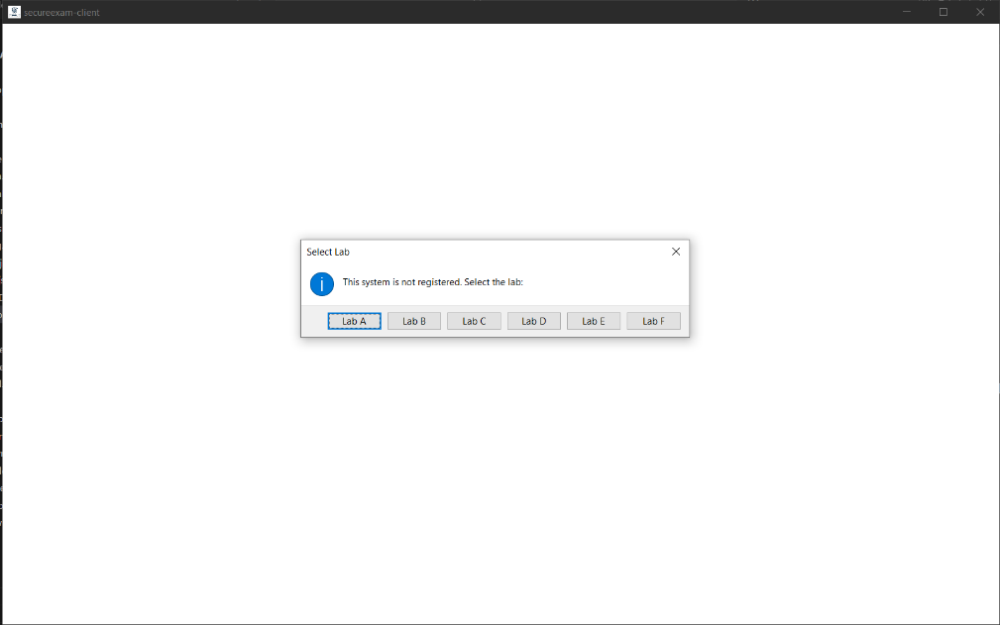
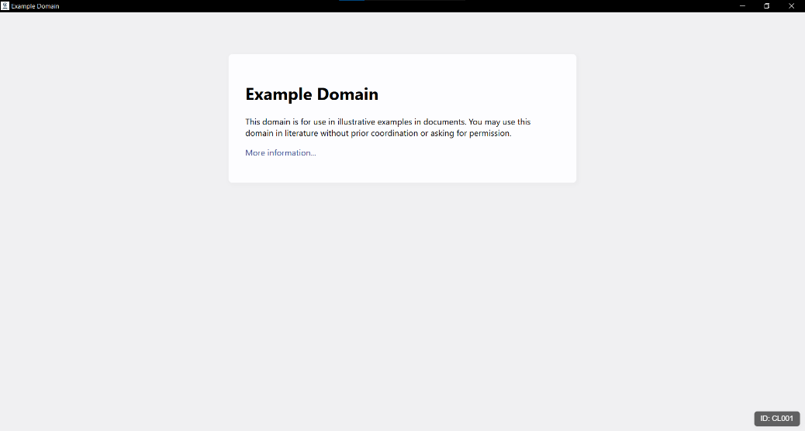
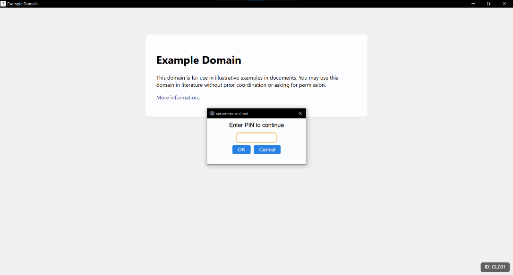
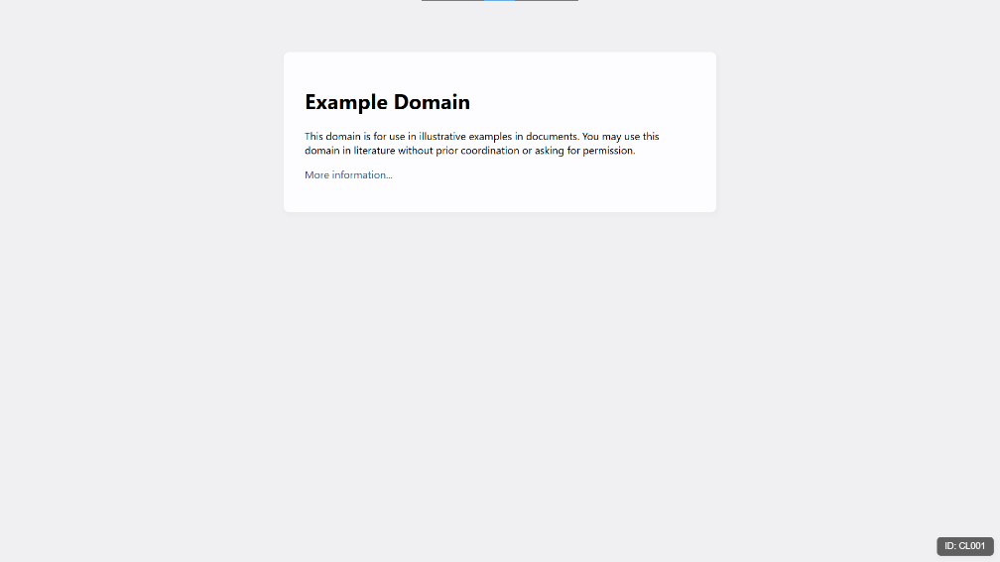
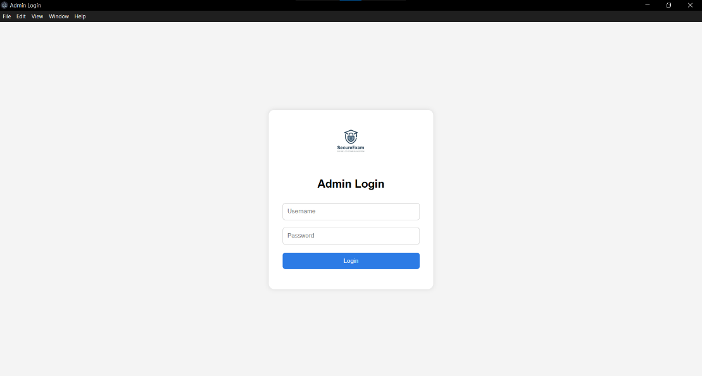
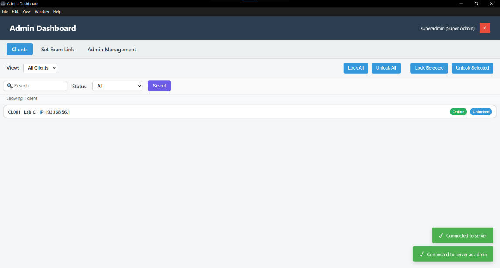
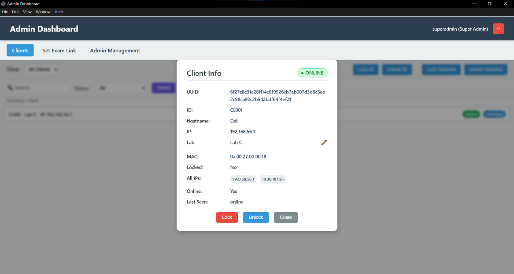
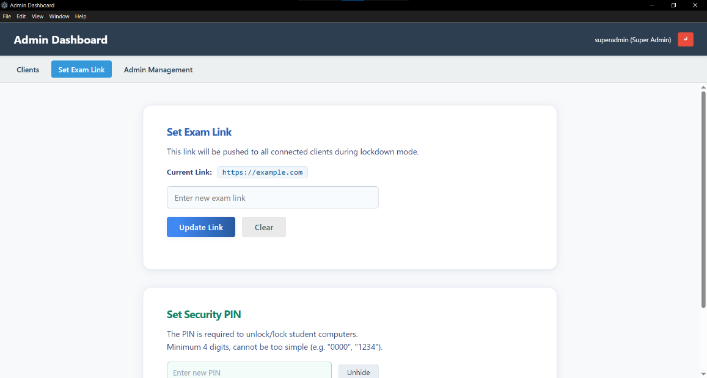
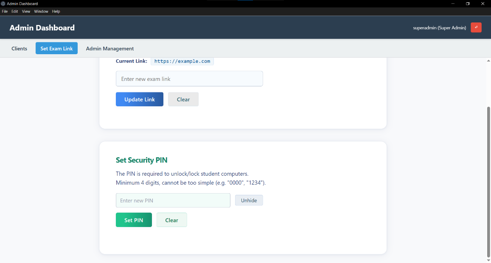
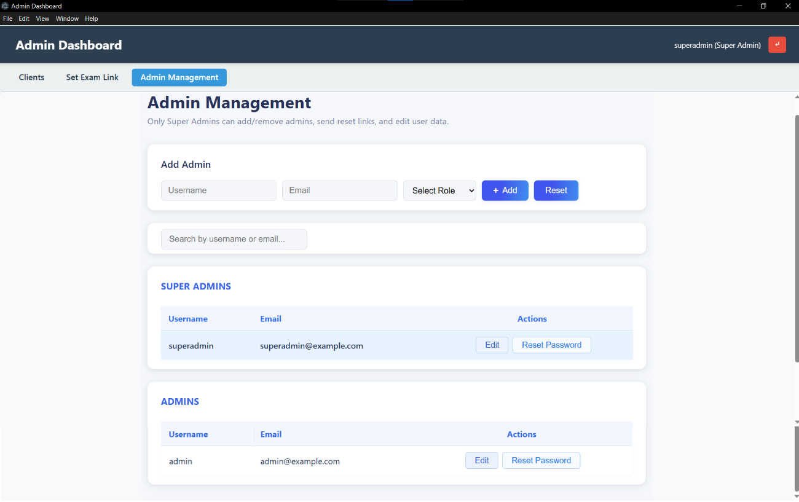

# SecureExam: Secure Lockdown Exam System

A distributed system designed to control and monitor multiple computers during exams using real-time communication.

---

## 🧠 Architecture

Admin App → Server → WebSocket → Client App → Lockdown Execution

---

## 💻 Components

### Admin App (Electron)
- Dashboard to manage clients
- Send lock/unlock commands
- Real-time monitoring

### Client App (Electron)
- Connects to server via WebSocket
- Receives commands
- Enforces lockdown environment

### Server (Node.js)
- REST API handling
- WebSocket communication
- Client state tracking

### Native Helper (C++)
- Handles low-level system restrictions
- Used as compiled executable by client

---

## 🚀 Features
- Real-time system control
- Lock/unlock multiple machines
- Client status tracking (online/offline)
- Admin dashboard interface

---

## ⚠️ Note
Backend hosting (Railway) is currently inactive.  
All source code and system architecture are available.

---

## 🛠️ Tech Stack
- Electron
- Node.js
- WebSocket (ws)
- C++

---

## 📌 Future Improvements
- Stronger authentication
- Encryption for WebSocket communication
- Better tamper resistance

---

## 🔐 Security Considerations

- Client-server communication relies on WebSocket and may be vulnerable without authentication hardening  
- Client-side restrictions can potentially be bypassed if system-level controls are not enforced properly  
- Future improvements include secure authentication, encrypted communication, and tamper detection

---

## 📸 Screenshots

